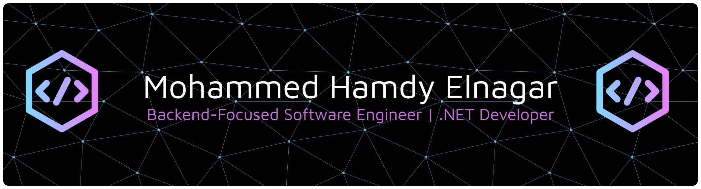

<!-- ===================== HERO ===================== -->

  

  

  
  
  

---

## 🧑‍💻 About Me

<table>
<tr>
<td>

🎓 **Information Systems Student**
Ain Shams University

</td>
<td>

💻 **Backend .NET Developer**
C# • ASP.NET Core • EF Core

</td>
</tr>

<tr>
<td>

🗄️ **Backend & Database Development**
SQL Server • T-SQL • Database Design

</td>
<td>

📊 **GPA**
**3.8 / 4.0**

</td>
</tr>

<tr>
<td>

🥇 **Tawjeh .NET**
Rank 1 • 4 Sprints • ~50 Trainees

</td>
<td>

🧠 **AI & Problem Solving**
AI/ML Foundations • CP • Algorithms

</td>
</tr>
</table>

---

## 🛠️ Technical Skills

<table>
<tr>
<td width="50%" valign="top">

### 💻 Backend & .NET

`C#` · `ASP.NET Core` · `MVC`
`Entity Framework Core` · `REST APIs`

**Software Engineering**

`OOP` · `SOLID` · `Clean Architecture`
`Design Patterns` · `N-Tier` · `DI` · `Repository Pattern`

</td>

<td width="50%" valign="top">

### 🗄️ Database Development

`SQL Server` · `T-SQL` · `Database Design`
`ERD` · `Stored Procedures` · `Views`
`UDFs` · `Transactions` · `JOINs`

</td>
</tr>

<tr>
<td width="50%" valign="top">

### 🤖 AI & Machine Learning

`Python` · `Scikit-Learn` · `OpenCV`
`MediaPipe` · `Pandas` · `NumPy`

**Foundations**

Machine Learning · Data Analysis
Computer Vision · Data Preprocessing

</td>

<td width="50%" valign="top">

### 🧠 Problem Solving

`Algorithms` · `Data Structures`
`Complexity Analysis`

**Platforms**

Codeforces · LeetCode

**Competitive Programming**

</td>
</tr>
</table>

### 🔧 Tools

`Git` · `GitHub` · `Postman` · `Bootstrap`

---

## 🚀 Projects

<table>
<tr>
<td width="50%" valign="top">

### 💼 Employee Management Portal

[🔗 Repository](https://github.com/Mohammed-Elnagar11/ITI-.NET-Tasks/tree/main/MVC/SocialMedia)

**ASP.NET Core MVC · C# · EF Core · SQL Server · Identity · AutoMapper**

Developed an N-Tier employee management web application using ASP.NET Core MVC. Applied Dependency Injection, Repository Pattern, Identity, AutoMapper, Middleware, and Sessions.

</td>

<td width="50%" valign="top">

### 🗄️ School Management System Database

[🔗 Repository](https://github.com/Mohammed-Elnagar11/School_DB-Tawjeh_Task-)

**SQL Server · T-SQL · Database Design**

Designed and implemented a normalized relational database with constraints, relationships, and business rules. Developed Stored Procedures, Views, UDFs, Transactions, and complex JOIN queries.

</td>
</tr>

<tr>
<td width="50%" valign="top">

### 💻 Employee Management System

[🔗 Repository](https://github.com/Mohammed-Elnagar11/Employee-Management-System-Tawjeh-Task-)

**C# · .NET**

Developed an Employee Management System using OOP, Data Structures, Delegates, and Events. Implemented a custom `Result<T>` pattern for structured error handling.

</td>

<td width="50%" valign="top">

### 🌐 Saffron Room

[🔗 Live Demo](https://mohammed-elnagar11.github.io/Saffron-Room/)

**HTML5 · CSS3 · Bootstrap 5 · Font Awesome · JavaScript**

Developed a responsive multi-page e-commerce website with product catalog, About Us, and Contact pages. Implemented responsive layouts using Bootstrap 5 and enhanced UI/navigation with Font Awesome.

</td>
</tr>

<tr>
<td width="50%" valign="top">

### 🤖 Emotra

[🔗 Repository](#)

**Python · OpenCV · MediaPipe · Scikit-Learn · Pandas · NumPy**

Developed a real-time Computer Vision system using MediaPipe Face Mesh and a Random Forest Classifier to analyze facial expressions and detect 6 emotions and cognitive states, supporting students during study sessions.

**🏆 Featured by news channels among 30 showcased projects.**

</td>

<td width="50%" valign="top">

### 🧠 Problem Solving

**Algorithms · Data Structures · Complexity Analysis**

Competitive Programming practice focused on algorithms, data structures, and algorithmic problem-solving.

</td>
</tr>
</table>

> More projects and solutions are available across my GitHub repositories.

---

## 🏆 Achievements

* 🥇 Rank 1 on the **Tawjeh .NET Leaderboard** after 4 Sprints among ~50 trainees.
* 📰 **Emotra** was featured by news channels among 30 showcased projects.

---

## 👥 Community

**Open Source Community (OSC) – Ain Shams University**
Science & Technology Committee / Monitor

**Robotech ASU**
AI Committee Member

**acmASCIS**
Competitive Programming Member

---

## 📊 GitHub Stats

  

  
  
  

---

## 📫 Let's Connect

  
  

  <i>Building. Learning. Solving. Sharing. 🚀</i>

